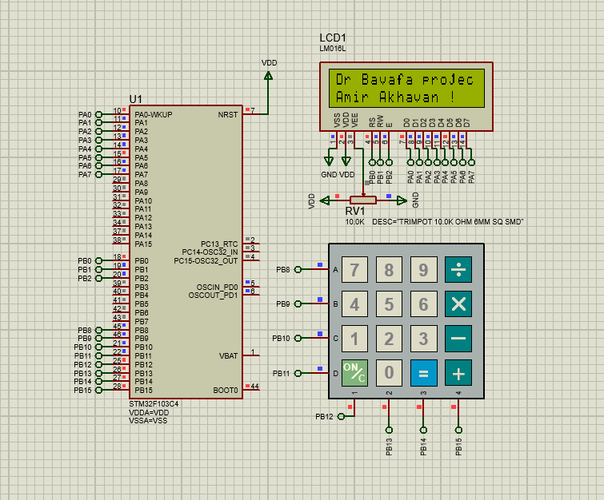
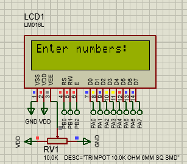
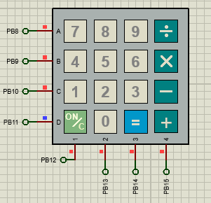

# Calculator Project Using STM32F103C4, 16x2 LCD, and 4x4 Keypad

This project was developed for the **Microprocessor Course** during **Winter 2025** by **Amir Akhavan Safar**.

> 

## 📌 Project Overview

This project implements a basic **calculator** using the **STM32F103C4** microcontroller. The calculator takes user input via a **4x4 matrix keypad** and displays expressions and results on a **16x2 character LCD**.

It supports basic arithmetic operations: addition, subtraction, multiplication, and division.

## 🧠 Features

### 🔢 Inputs

- **Input device**: 4x4 Keypad
- **Defined buttons**:
  - Digits: `0–9`
  - Operators: `+`, `-`, `*`, `/`
  - Functions: `=`, `C`

| Button | Function               |
|--------|------------------------|
| 0–9    | User digit input       |
| +      | Add numbers            |
| -      | Subtract numbers       |
| *      | Multiply numbers       |
| /      | Divide numbers         |
| =      | Show result            |
| C      | Clear and reset input  |

### ➕ Operations

- Supports:
  - Addition `+`
  - Subtraction `-`
  - Multiplication `*`
  - Division `/` (excluding division by zero)

### 🖥 LCD Display

- **Type**: 16x2 Character LCD
- **Line 1**: Displays the current expression (e.g. `12+7`)
- **Line 2**: Displays the result (e.g. `=19`)
- **Real-time updates**: Displays current input and output live

### ❌ Clear Function

- Pressing **`C`**:
  - Clears all inputs
  - Resets the calculator state
  - Clears the LCD

---

## 🛠 Components Used

| Part                   | Quantity | Description                     | 
|------------------------|----------|---------------------------------|
| STM32F103C4            | 1        | ARM Cortex-M3 microcontroller   |
| 16x2 LCD               | 1        | Character LCD display           |
| 4x4 Matrix Keypad      | 1        | Input device                    |
| Potentiometer/Resistor | 1        | LCD contrast control            |
| Keil uVision           | -        | Code development environment    |
| Proteus                | -        | Simulation software             |

---

## 📐 Wiring and Pin Mapping

### 🧾 LCD to STM32F103C4 Pin Mapping

> 

| LCD Pin | Description        | STM32 Pin | Description                    |
|---------|--------------------|-----------|--------------------------------|
| VSS     | Ground             | GND       | Ground                         |
| VDD     | +3.3V / +5V        | VCC       | Power supply                   |
| V0      | Contrast Control   | Potentiometer | Adjust LCD contrast        |
| RS      | Register Select    | PB0       | Output                         |
| RW      | Read/Write         | PB1       | Output                         |
| E       | Enable             | PB2       | Output                         |
| D0–D7   | Data Lines         | PA0–PA7   | Output                         |
| LED+    | Backlight VCC      | VCC       | Power supply                   |
| LED−    | Backlight Ground   | GND       | Ground                         |

### 🧾 Keypad to STM32F103C4 Pin Mapping
> 

| Keypad Line | Description | STM32 Pin | Mode     |
|-------------|-------------|-----------|----------|
| Row 1       | Top Row     | PB8       | Output   |
| Row 2       |             | PB9       | Output   |
| Row 3       |             | PB10      | Output   |
| Row 4       |             | PB11      | Output   |
| Col 1       | Left Column | PB12      | Input    |
| Col 2       |             | PB13      | Input    |
| Col 3       |             | PB14      | Input    |
| Col 4       |             | PB15      | Input    |

---

## 🧠 Code Structure

### 🧩 Initialization Functions

- `keypad_init()` — Initializes the keypad
- `keypad_getkey()` — Returns the pressed key
- `LCD_Init()` — Initializes the LCD
- `LCD_Command()` / `LCD_Data()` — Sends command/data to LCD
- `LCD_Clear()` / `LCD_SetCursor()` — Clears screen or sets cursor
- `LCD_Print()` — Prints text on the LCD

### 🔁 Main Logic: `calculator_logic()`

- Handles input capture
- Processes arithmetic operations
- Displays live results on LCD

---

## 🛠 Development Workflow

### 1. Circuit Design in Proteus

- LCD connected to **GPIOA**
- Keypad connected to **GPIOB**

### 2. Code Development in Keil

- Implement keypad and LCD control functions
- Develop calculator logic

### 3. Simulation

- Simulate the full circuit in Proteus
- Test all input/output behavior

---

## ▶️ How It Works (Runtime Flow)

1. Upon power-up, the LCD shows a welcome message.
2. User inputs a math expression via keypad.
3. The expression appears live on LCD Line 1.
4. Pressing `=` calculates and displays the result on Line 2.
5. Pressing `C` clears the screen and resets the calculator.

---

## 🧑‍💻 Author

**Amir Akhavan Safar**  
Microprocessor Course Project  
Winter 2025  

---

## 📄 License

This project is licensed under the MIT License.
